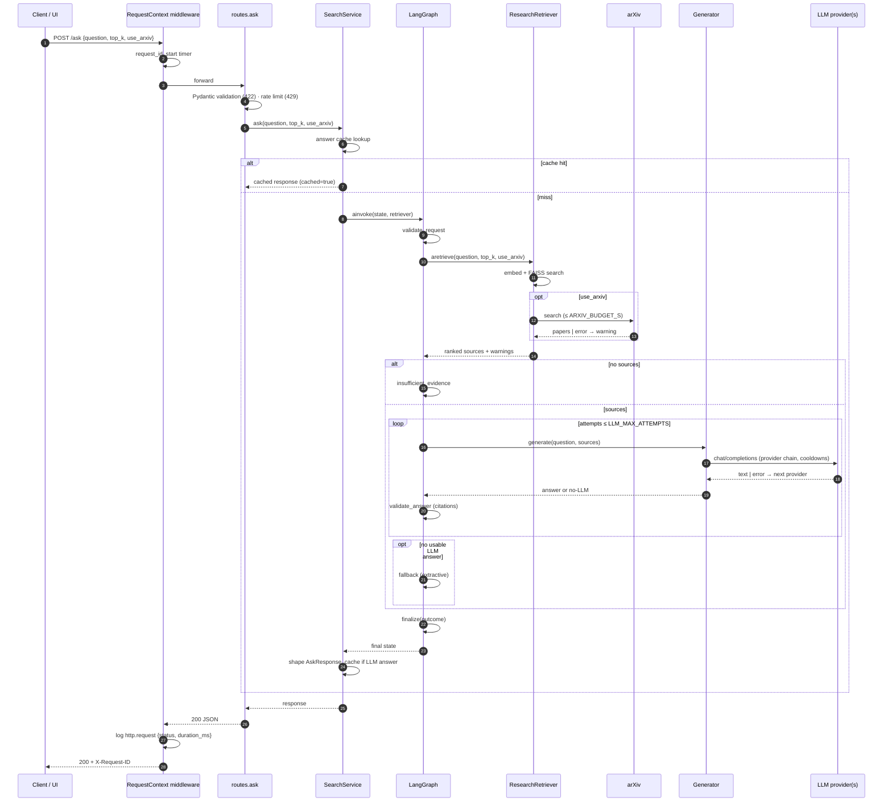

# Request sequence — `POST /ask`

```mermaid
sequenceDiagram
    autonumber
    participant C as Client / UI
    participant M as RequestContext middleware
    participant R as routes.ask
    participant S as SearchService
    participant G as LangGraph
    participant RT as ResearchRetriever
    participant X as arXiv
    participant GEN as Generator
    participant P as LLM provider(s)

    C->>M: POST /ask {question, top_k, use_arxiv}
    M->>M: request_id, start timer
    M->>R: forward
    R->>R: Pydantic validation (422) · rate limit (429)
    R->>S: ask(question, top_k, use_arxiv)
    S->>S: answer cache lookup
    alt cache hit
        S-->>R: cached response (cached=true)
    else miss
        S->>G: ainvoke(state, retriever)
        G->>G: validate_request
        G->>RT: aretrieve(question, top_k, use_arxiv)
        RT->>RT: embed + FAISS search
        opt use_arxiv
            RT->>X: search (≤ ARXIV_BUDGET_S)
            X-->>RT: papers | error → warning
        end
        RT-->>G: ranked sources + warnings
        alt no sources
            G->>G: insufficient_evidence
        else sources
            loop attempts ≤ LLM_MAX_ATTEMPTS
                G->>GEN: generate(question, sources)
                GEN->>P: chat/completions (provider chain, cooldowns)
                P-->>GEN: text | error → next provider
                GEN-->>G: answer or no-LLM
                G->>G: validate_answer (citations)
            end
            opt no usable LLM answer
                G->>G: fallback (extractive)
            end
        end
        G->>G: finalize(outcome)
        G-->>S: final state
        S->>S: shape AskResponse, cache if LLM answer
    end
    S-->>R: response
    R-->>M: 200 JSON
    M->>M: log http.request {status, duration_ms}
    M-->>C: 200 + X-Request-ID
```
