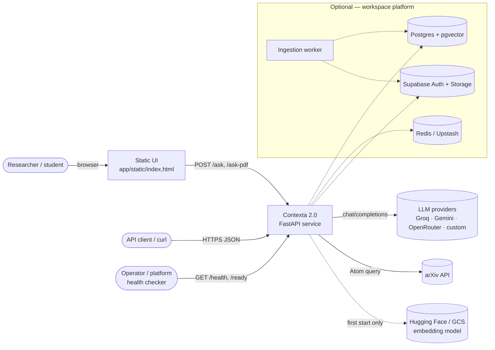

# System context

```mermaid
flowchart LR
    user([Researcher / student]) -->|browser| ui[Static UI<br/>app/static/index.html]
    client([API client / curl]) -->|HTTPS JSON| api
    ui -->|POST /ask, /ask-pdf| api[Contexta 2.0<br/>FastAPI service]
    ops([Operator / platform<br/>health checker]) -->|GET /health, /ready| api

    api -->|chat/completions| llm[(LLM providers<br/>Groq · Gemini · OpenRouter · custom)]
    api -->|Atom query| arxiv[(arXiv API)]
    api -.->|first start only| hf[(Hugging Face / GCS<br/>embedding model)]

    subgraph optional[Optional — workspace platform]
      pg[(Postgres + pgvector)]
      redis[(Redis / Upstash)]
      supa[(Supabase Auth + Storage)]
      worker[Ingestion worker]
    end
    api -.-> pg
    api -.-> redis
    api -.-> supa
    worker -.-> pg
    worker -.-> supa
```
